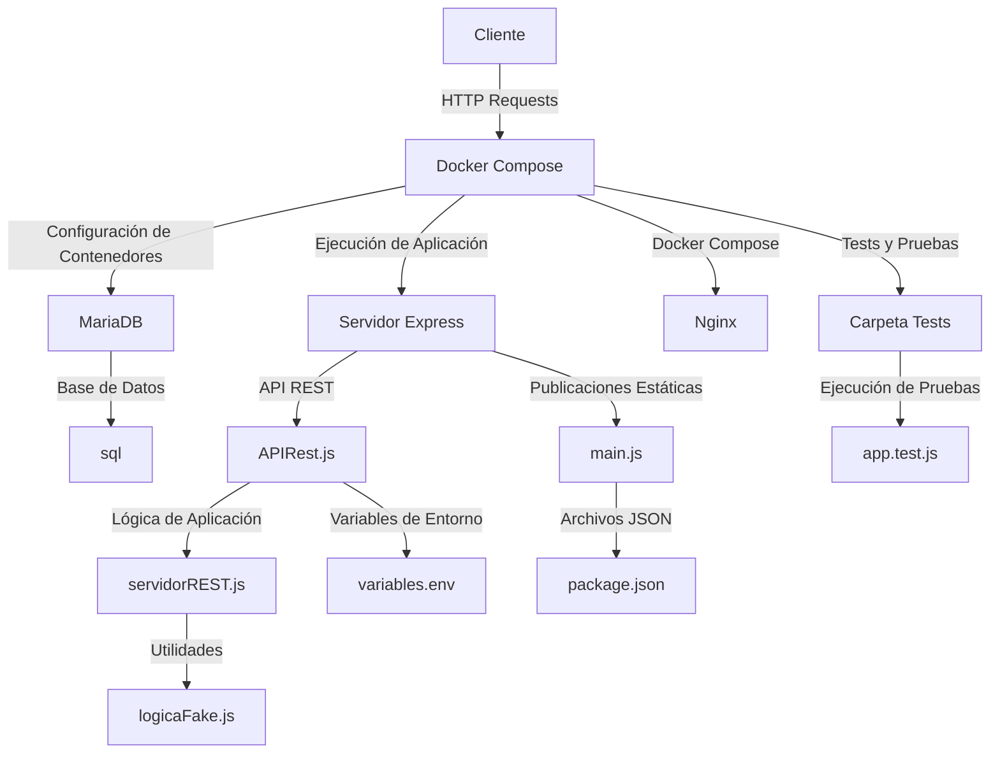

# BACKEND
## Estructura gráfica del proyecto


# Estructura del Backend

- `src/`: Contiene el código fuente de la web.
    - `mariadb/`: Contiene el Dockerfile que se encarga de crear la imagen del contenedor de MariaDB.
        - `sql`: Contiene la base de datos para el proyecto. Leer con detenimiento el archivo LEEME4VECES.txt para acceder a ella
    - `nodejs/`: Contiene el Dockerfile que se encarga de crear la imagen del contenedor de Node.js.
        - `app-web/`: Contiene el Dockerfile para levantar el contenedor con la última imagen de Nginx
        - `tests`: Contiene el archivo ``app.test.js``para correr las pruebas unitarias automáticas
        - `APIRest.js`: Contiene el código fuente de la API REST para la base de datos.
        - `Dockerfile`: Se encarga de levantar la versión 18 de node, situarse en el directorio correcto dentro del contenedor y copiar los archivos .json y el archivo main.js dentro del contenedor. Instala también todas las dependencias necesarias y expone el puerto 8080 para que el resto de la web funcione. Por último, ejecuta el comando CMD que se encarga de ejecutar tanto node como main.js
        - `logicaFake.js`: Contiene el código fuente de la lógica para generar los datos fake solicitados por parte del Frontend para iniciar la sesión de un usuario a la aplicación
        - `main.js`: Es el principal medio de comunicación entre el Backend y el Frontend. Se encarga de levantar el servidor en el puerto 8080, que es donde se expone la API REST.
        - `package.json` : Contiene las dependencias necesarias para levantar el proyecto. También da información acerca del autor de la API, la versión de la aplicación y los scripts que se encargan de ejecutarlas.
        - `servidorREST.js`: Es la lógica real de la aplicación. Contiene las funciones necesarias para hacer métodos GET, POST y DELETE a la base de datos. La API Rest está en constante comunicación con ella.
    - `docker-compose.yml`: Contiene el archivo que se encarga de levantar los contenedores necesarios para correr la aplicación. Es la piedra angular que se encarga de poner en marcha los contenedores de mariadb, nodejs y nginx para que se puedan visualizar todos los resultados en el navegador.
    - `variables.env`: Contiene los datos sensibles de la aplicación, como las contraseñas, las clave de acceso y el usuario administrador. No serán publicados en Github y será necesario leerse el archivo LEEME4VECES.txt para poder acceder a ellas
    - `.gitignore`: Contiene los archivos o carpetas que se ignoran por parte de GIT para subir a la nube. Esto es necesario para evitar que se suban archivos innecesarios o comprometidos al repositorio.


# Sprint 0

## ¿Cómo funciona esta primera versión?

He seguido las instrucciones de Jordi Bataller, creando una carpeta propia para MariaDB y Node.js, con sus respectivos Dockerfiles. Después, he creado un archivo `docker-compose.yml` que relaciona ambos contenedores y automatiza todo aquello que deberíamos hacer a mano.

### MariaDB

El Dockerfile de MariaDB funciona de la siguiente manera:

- **Imagen Base**: Se utiliza la última imagen de MariaDB de la web oficial de Docker Hub ([mariadb](https://hub.docker.com/_/mariadb)). Para crear esta imagen se ejecuta el comando `docker pull mariadb`.
- **Contraseña**: Se crea una variable que establece una contraseña (en esta primera versión es `1234`).
- **Inicialización**: Se ejecuta el comando para crear la base de datos (ubicada en el directorio `/sql` dentro de la misma carpeta de MariaDB) y se define la ruta del entrypoint que inicializará la base de datos en el contenedor de MariaDB.

#### SQL

El archivo `ejemploBBDD.sql` contiene la creación de la base de datos y la tabla que se utilizará en el proyecto. Aquí se guardará la información que se reciba de los sensores de gas. En este instante, contiene los siguientes campos:

- `id`: Es la Primary Key y es un valor que se autoincrementa.
- `hora`: Está definida por el tipo de variable `TIME` y debe ser `NOT NULL`, debido a que no puede dar un valor 0. Tendrá la siguiente estructura: "00:00", siendo el primer par de ceros las horas (de 1 a 24) y el segundo par los minutos.
- `lugar`: Está definido por el tipo de variable `VARCHAR` que puede contener hasta 255 caracteres, tampoco puede ser `NULL`.
- `id_sensor`: Es un valor entero `INT` y será el encargado de identificar a cada sensor individualmente.
- `valorGas`: Es la medición que dará el sensor de gas y está definida por un número `DECIMAL(5,2)`, que tampoco puede ser `NULL`.
- `valorTemperatura`: Es la medición que dará el sensor de temperatura. Sigue estando definida por un número `DECIMAL(5,2)` y su implementación se realizará en un futuro.

Un ejemplo de inserción de datos podría ser el siguiente:
```sql
INSERT INTO mediciones (id, hora, lugar, idSensor, valorGas, valorTemperatura)
VALUES (333, '12:00', 'Cartagena', 130, 55, 35);
```
Mediante la consola de MariaDB desde dentro de su contenedor, se ha comprobado de manera exitosa que los datos se insertan correctamente y que la tabla se actualiza recargando la página en tu propia máquina en local: [http://localhost:8080](http://localhost:8080)

### Node.js

Dentro de la carpeta de Node.js podrás encontrar todos los módulos que se crean al iniciar por primera vez npm con Node.js (el comando es: `npm init -y`).

El Dockerfile de Node.js funciona de la siguiente manera:

- **Imagen Base**: Se utiliza la última imagen de Node.js de la web oficial de Docker Hub ([node](https://hub.docker.com/_/node)). Para crear esta imagen se ejecuta el comando `docker pull node`.
- **Directorio de Trabajo**: Se crea el directorio donde se ejecutará nuestra lógica de negocio ubicada en el archivo `main.js`.
- **Copiar Archivos de Dependencias**: Se copian los archivos generados por el comando `npm init -y` (`package.json` y `package-lock.json`) desde nuestro host al sistema de archivos del contenedor Docker.
- **Instalación de Dependencias**: Para comunicarse con la base de datos de MariaDB, es necesario que se ejecute la instalación con el comando `npm install mariadb`.
- **Copiar Código**: Con `COPY . .` copiamos el resto del código de nuestra máquina host al contenedor Docker en el directorio correspondiente.
- **Exponer Puerto**: Abrimos el puerto 8080 de nuestra máquina local con el comando `EXPOSE 8080`. De esta manera podremos acceder al JSON de la base de datos con la siguiente URL: [http://localhost:8080](http://localhost:8080).
- **Ejecutar Aplicación**: Por último, ejecutamos en la consola nuestro `main.js` con el comando `CMD ["node", "main.js"]`.

#### ServidorREST

En el archivo `servidorREST.js` se ha creado un pequeño servidor REST donde se ha configurado la base de datos de MariaDB, pasándole los parámetros para poder acceder a la misma. También, se ha implementado una API con Swagger, que es una herramienta gráfica que ayuda a probar la API creada. Esta API se encarga de hacer consultas a la base de datos de manera de prueba. Puede realizar tanto GET como POST, apuntando a la tabla de mediciones (que contiene los campos: `id`, `hora`, `lugar`, `idSensor`, `valorGas`, `valorTemperatura`).

El funcionamiento de la API se puede ver de manera muy visual yendo a la siguiente dirección URL: [http://localhost:3000/api-docs/](http://localhost:3000/api-docs/).

### docker-compose.yml

Este es un archivo que se encarga de unir tanto el Dockerfile de MariaDB como el Dockerfile de Node.js. Con este archivo, se ejecutan automáticamente ambos sin la necesidad de teclear nada por la terminal.

- **MariaDB**: Se abre un puerto en 3306 y un puerto de Docker (también el 3306). Después, crea una red interna que es esencial para que ambos contenedores funcionen correctamente sincronizados. En mi caso se llama "redsprint0". He implementado también una verificación de salud del contenedor de MariaDB. El comando `healthcheck` se encarga de pasar unos tests internos que aseguran el correcto funcionamiento del contenedor.
- **Node.js**: En el módulo de Node.js se abre también un puerto (en este caso el 8080 para que no se solape con el 3306 de MariaDB) y se crea también la misma red que hará de puente entre los dos contenedores.

# Sprint 1

## ¿Cómo funciona esta segunda versión?

He logrado separar la lógica de la web de la API Rest. La lógica de la web se encuentra en el archivo `servidorREST.js` y la lógica de la API Rest en el archivo `APIRest.js`. Ambos archivos están conectados a una base de datos llamada "**ejemploBBDD**" que está en el contenedor de MariaDB.

### MariaDB
El Dockerfile de MariaDB funciona de la siguiente manera:
- Usa la última imagen de mariadb y copia el archivo **.sql** con los datos necesarios para crear las tablas en el volumen */docker-entrypoint-initdb.d/*

#### SQL

El archivo `ejemploBBDD.sql` contiene toda la base de datos y las 3 tabla que se utilizarn en el proyecto. Aquí se guardará la información que se reciba de los sensores de gas. En este instante, contiene las siguientes 3 tablas:
- **usuarios**: Contiene los datos de los usuarios.
	- **id_usuario**: Identificador único del sensor, autoincremental.
    - **correo**: Correo del usuario, 255 caracteres como máximo.
    - **contrasena**: Contraseña del usuario, 255 caracteres como máximo.
- **sensores**: Contiene los datos de los sensores.
    - **id_sensor**: Identificador único del sensor, autoincremental.
    - **id_usuario**: id del usuario, actúa como Foreign Key que hace referencia a la tabla **usuarios**.
- **mediciones**: Contiene los datos de las mediciones de los 2 sensores.
    - **id**: Identificador único de la medición, autoincremental.
    - **hora**: Hora en la que se realizó la última medición.
    - **latitud**: Latitud de la última medición tomada por el sensor.
    - **longitud**: Longitud de la última medición tomada por el sensor.
    - **id_sensor**: id del sensor, actúa como Foreign Key que hace referencia a la tabla **sensores**.
    - **valorGas**: Valor del gas en la última medición tomada por ese sensor.
    - **valorTemperatura**: Valor de la temperatura en la última medición tomada por ese sensor.

Un ejemplo de inserción para las 3 tablas podría ser el siguiente:
```sql
INSERT INTO usuarios (correo, contrasena) VALUES ('usuario1@example.com', 'password1'),
INSERT INTO sensores (id_usuario) VALUES (1),
INSERT INTO mediciones (hora, latitud, longitud, id_sensor, valorGas, valorTemperatura) VALUES ('10:00', 40.416775, -3.703790, 1, 40.00, 35.00),
```

### Nodejs
Como novedad en este sprint, se ha logrado separar el archivo de la API (archivo llamado **APIRest.js**) con el de la lógica de la aplicación (archivo llamado **servidorRest.js**). Estos 2 archivos tienen un mismo archivo de conexión: **main.js**
El Dockerfile del contenedor Nodejs sigue funcionando de la siguiente manera:
- **Imagen Base**: Se utiliza la última imagen de Node.js de la web oficial de Docker Hub ([node](https://hub.docker.com/_/node)). Para crear esta imagen se ejecuta de manera automática desde dentro del contenedor el comando `docker pull node`.
- **Directorio de Trabajo**: Se crea y nos situamos en el directorio donde se ejecutará todo: `/home/nodejs`.
- **Copiar Archivos de Dependencias**: Se copian los archivos generados por el comando `npm init -y` (`package.json` y `package-lock.json`) desde nuestra máquina local al sistema de archivos del contenedor Docker. También, se le pasa el archivo **main.js** que es el medio de comunicación entre la API Rest y la lógica de la aplicación.
- **Instalación de Dependencias**: Se instalan todas las dependencias que requiere el contenedor nodejs, como puede ser `mariadb`, `cors` y `dotenv`
- **Copiar Código**: Con `COPY . .` copiamos el resto del código de nuestra máquina local al contenedor Docker en el directorio anteriormente mencionado.
- **Exponer Puerto**: Abrimos el puerto 8080 de nuestra máquina local con el comando `EXPOSE 8080`. De esta manera podremos acceder al JSON de la base de datos con la siguiente URL: [http://localhost:8080](http://localhost:8080).
- **Ejecutar Aplicación**: Por último, se pone en marcha todo ejecutándose de manera automática desde dentro del contenedor lo siguiente: `CMD ["node", "main.js"]`.

#### ServidorREST

El archivo `servidorREST.js` ahora únicamente contiene las funciones que precisan de la lógica de negocio. Son todas ellas asíncronas, y están en constante conexión con la base de datos, debido a que se ha creado el archivo `variables.env` que es donde se guarda todas las claves de acceso a la misma. En la parte final del archivo, se exportan todas estas funciones con **module.exports** para que puedan ser utilizadas por la API Rest.

#### APIRest

Se ha logrado implementar las actualizaciones de la base de datos en la API de Swagger. Esta API se encarga de hacer consultas a la base de datos de manera muy visual. Se puede realizar lo siguiente:

- **GET** a la tabla de `mediciones` para obtener cualquier **id del sensor**
- **POST** a la tabla de `mediciones` para agregar una nueva **medición**
- **GET** a la tabla de `usuarios` para obtener la **id del usuario** que requiramos de información
- **POST** a la tabla de `usuarios` para agregar un **nuevo usuario**
- **DELETE** a la tabla de `usuarios` para **eliminar un usuario**
**

Por implementar:
 - **GET** al campo de `valorGas` de la tabla de mediciones para consultar si hay una alerta
Puede realizar tanto GET como POST, apuntando a la tabla de mediciones (que contiene los campos: `id`, `hora`, `lugar`, `idSensor`, `valorGas`, `valorTemperatura`).

El funcionamiento de la API se puede ver de manera muy visual yendo a la siguiente dirección URL: [http://localhost:8080/api-docs/](http://localhost:8080/api-docs/).

### docker-compose.yml

Es un archivo que se encarga de unir los contenedores de mariadb como el contenedor de nodejs y el contenedor de nginx. Con este archivo, se levantan todos automáticamente ambos sin la necesidad de teclear nada por la terminal.

- **MariaDB**: Se abre un puerto en 3306 y un puerto de Docker (también el 3306). Cada vez que se levanta el contenedor, se reinicia automáticamente con la implementacio del comando `restart: always` En esta versión, se elimina la red interna debido a que ya no era necesaria para la conexión entre contenedores. También, se hace referencia al archivo de variables `variables.env`. Se monta por último los volúmenes en: `./mariadb/sql:/docker-entrypoint-initdb.d/` y en `db_data:/var/lib/mysql`
- **Node.js**: En el módulo de Node.js se abre también un puerto (en este caso el 8080 para que no se solape con el 3306 de MariaDB). También se hace referencia al archivo de variables `variables.env`. Y por último, se comprueba que mientras no esté el puerto **3306** del contenedor de **mariadb** operativo, no se ejecuta el archivo `main.js` dentro de su terminal
- **Nginx**: Se abre un puerto en 80 y se le pasa el contexto situado en `./nodejs/app_web` que es necesario para ejecutar el Frontend en la página web


