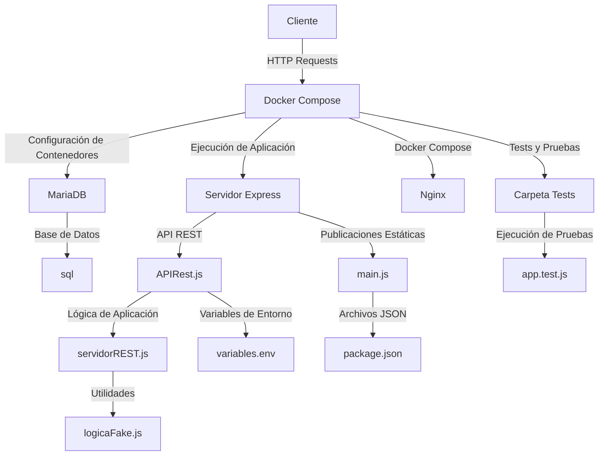

# Proyecto VIMYP

Este proyecto contiene tanto el frontend como el backend de la aplicación VIMYP. A continuación se describe la estructura del proyecto y cómo automatizar el despliegue utilizando un script de PowerShell.

## Estructura del Proyecto

## Frontend

El directorio `src/` contiene el código fuente principal de la página web del proyecto VIMYP.

#### Estructura de carpetas

- `html/`: Contiene todos los archivos HTML de cada una de las páginas diseñadas en Axure.
- `style/`: Contiene archivos CSS para estilos globales y específicos de cada HTML.
- `js/`: Contiene archivos JavaScript para la lógica de la aplicación y algunas funcionalidades extra del frontend como animaciones.
- `img/`: Contiene imágenes utilizadas en la aplicación, como logos, iconos y fondos.
- `assets/`: Contiene iconos utilizados en el login.

#### Archivos principales

- `index.html`: Página principal de la aplicación, que se carga al iniciar la aplicación.

#### Tecnologías utilizadas

- HTML, CSS y JavaScript para la estructura, estilo y lógica de la aplicación frontend.
- Bootstrap para la creación de componentes de interfaz de usuario y la maquetación responsive.
- Google Fonts para la tipografía utilizada en la aplicación.
- Font Awesome para los iconos utilizados en la aplicación.

## Backend



## Estructura del Backend

- `src/`: Contiene el código fuente de la web.
    - `mariadb/`: Contiene el Dockerfile que se encarga de crear la imagen del contenedor de MariaDB.
        - `sql`: Contiene la base de datos para el proyecto. Leer con detenimiento el archivo LEEME4VECES.txt para acceder a ella
    - `nodejs/`: Contiene el Dockerfile que se encarga de crear la imagen del contenedor de Node.js.
        - `app-web/`: Contiene el Dockerfile para levantar el contenedor con la última imagen de Nginx
        - `tests`: Contiene el archivo ``app.test.js``para correr las pruebas unitarias automáticas
        - `APIRest.js`: Contiene el código fuente de la API REST para la base de datos.
        - `Dockerfile`: Se encarga de levantar la versión 18 de node, situarse en el directorio correcto dentro del contenedor y copiar los archivos .json y el archivo main.js dentro del contenedor. Instala también todas las dependencias necesarias y expone el puerto 8080 para que el resto de la web funcione. Por último, ejecuta el comando CMD que se encarga de ejecutar tanto node como main.js
        - `logicaFake.js`: Contiene el código fuente de la lógica para generar los datos fake solicitados por parte del Frontend para iniciar la sesión de un usuario a la aplicación
        - `main.js`: Es el principal medio de comunicación entre el Backend y el Frontend. Se encarga de levantar el servidor en el puerto 8080, que es donde se expone la API REST.
        - `package.json` : Contiene las dependencias necesarias para levantar el proyecto. También da información acerca del autor de la API, la versión de la aplicación y los scripts que se encargan de ejecutarlas.
        - `servidorREST.js`: Es la lógica real de la aplicación. Contiene las funciones necesarias para hacer métodos GET, POST y DELETE a la base de datos. La API Rest está en constante comunicación con ella.
    - `docker-compose.yml`: Contiene el archivo que se encarga de levantar los contenedores necesarios para correr la aplicación. Es la piedra angular que se encarga de poner en marcha los contenedores de mariadb, nodejs y nginx para que se puedan visualizar todos los resultados en el navegador.
    - `variables.env`: Contiene los datos sensibles de la aplicación, como las contraseñas, las clave de acceso y el usuario administrador. No serán publicados en Github y será necesario leerse el archivo LEEME4VECES.txt para poder acceder a ellas
    - `.gitignore`: Contiene los archivos o carpetas que se ignoran por parte de GIT para subir a la nube. Esto es necesario para evitar que se suban archivos innecesarios o comprometidos al repositorio.

## Automatización del Proyecto con PowerShell

El archivo `automatizacion.ps1` es un script de PowerShell diseñado para automatizar el proceso de configuración, construcción y despliegue de un proyecto Docker. El script se encarga de ejecutar todos los comandos necesarios para levantar los contenedores Docker y asegurar que el entorno esté limpio y listo para su uso.

## Características del Script

- Verifica si Docker y Docker Compose están instalados.
- Lee la versión de la aplicación desde el archivo `package.json`.
- Elimina contenedores e imágenes Docker antiguos.
- Crea una estructura de carpetas temporal y copia los archivos necesarios.
- Detiene y elimina contenedores y volúmenes existentes.
- Levanta los contenedores utilizando Docker Compose.
- Ejecuta pruebas dentro del contenedor de la aplicación.
- Muestra los logs de los contenedores.

## Uso

Para ejecutar el script y automatizar el despliegue de los contenedores Docker, sigue estos pasos:

1. Abre PowerShell en Windows.
2. Navega al directorio donde se encuentra el archivo `automatizacion.ps1`.
3. Ejecuta el siguiente comando:

   ```powershell
   .\automatizacion.ps1
   ```

El script se encargará de realizar todas las tareas necesarias para levantar los contenedores y preparar el entorno de desarrollo.

## Requisitos

- Windows con PowerShell.
- Docker y Docker Compose instalados.

## Aviso
Para la correcta ejecución y visualización del Proyecto, es necesario leer atentamente el archivo `.txt` ubicado en la raíz del proyecto llamado **LEEME4VECES.txt**
Este archivo contiene todas las claves y pasos que se deben de seguir para su correcta implementación

